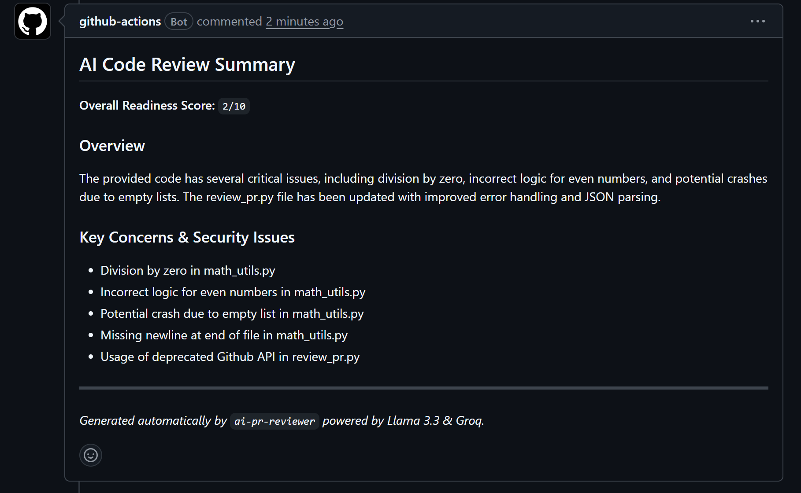
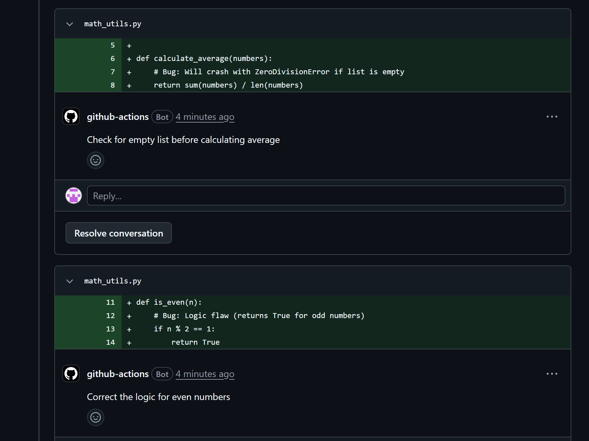

# AI Pull Request Reviewer

An automated code review agent built into GitHub Actions. It captures the diff from a pull request, sends it to Llama 3.3 (via Groq) for analysis with a strictly enforced output schema (Pydantic v2), and posts the review — both a summary and inline, line-specific comments — directly on the PR.

Inspired by tools like CodeRabbit, Qodo, and GitHub Copilot Reviews.

## Why this exists

Manual code review is slow, repetitive, and inconsistent — the same categories of issues (missing error handling, off-by-one bugs, unhandled edge cases) get missed or caught late by tired reviewers. This bot acts as an automated first pass: catching common issues within seconds of a PR being opened, so human reviewers can spend their time on architecture and intent instead of routine checks.

## Demo

The screenshots below are from a real test PR with intentionally planted bugs (division by zero, an inverted even/odd check, a missing empty-list guard).

**Summary comment:**



**Inline comments on the exact lines with bugs:**



## Architecture

```
Pull Request opened / updated
        │
        ▼
GitHub Actions workflow triggers (ai-review.yml)
        │
        ▼
review_pr.py fetches the diff via the GitHub API
        │
        ▼
Diff sent to Llama 3.3 (Groq) with a schema-constrained prompt
        │
        ▼
Response validated against a strict schema (Pydantic v2)
        │
        ├── Inline comments posted on the relevant lines
        └── Summary comment posted (score, overview, key issues)
```

## Features

- **Fast reviews** — uses Groq's inference engine (`llama-3.3-70b-versatile`), chosen specifically for low latency since this runs inside a CI pipeline, not a chat interface where a user can wait.
- **Structured, validated output** — the model's response is forced into a strict schema and validated with Pydantic v2 before anything is posted, rather than trusting free-form text.
- **Fully automated** — triggers on every `pull_request` event (`opened`, `synchronize`), no manual step required.
- **Inline + summary review** — flags issues on the exact line they occur, not just a general comment.

## Tech stack

Python 3.11 · Groq API (Llama 3.3 70B) · Pydantic v2 · PyGithub · GitHub Actions

## Project structure

```
.
├── .github/
│   └── workflows/
│       └── ai-review.yml    # CI/CD trigger on PR events
├── docs/
│   └── assets/               # Screenshots used in this README
├── review_pr.py               # Main review engine
├── requirements.txt           # Python dependencies
├── .gitignore
└── README.md
```

## Setup & local testing

### Prerequisites

- Python 3.10 or higher
- A [Groq API key](https://console.groq.com/)
- A GitHub Personal Access Token (for local testing only)

### Local installation

```bash
git clone https://github.com/YOUR_USERNAME/ai-pr-reviewer.git
cd ai-pr-reviewer
python -m venv .venv
source .venv/bin/activate   # Windows: .\.venv\Scripts\Activate.ps1
pip install -r requirements.txt
```

Create a `.env` file for local testing:

```
GROQ_API_KEY=your_groq_api_key
GITHUB_TOKEN=your_github_token
PR_NUMBER=1
```

Run it locally:

```bash
python review_pr.py
```

### Enabling it on GitHub Actions

1. Go to **Settings → Secrets and variables → Actions** in your repo.
2. Add a new repository secret named `GROQ_API_KEY` with your Groq API key.
3. Confirm `.github/workflows/ai-review.yml` is present on your default branch.
4. Open a pull request — the bot reviews it automatically within seconds.

## Design decisions & limitations

- Diffs are truncated at ~12,000 characters to keep prompt size and cost predictable on very large PRs.
- Schema validation failures don't crash the workflow — a fallback notice is posted on the PR instead of failing silently.
- Like any LLM-based reviewer, it can occasionally flag something already handled elsewhere in the code — treat it as a fast first pass, not a replacement for human review.

## License

Distributed under the MIT License.